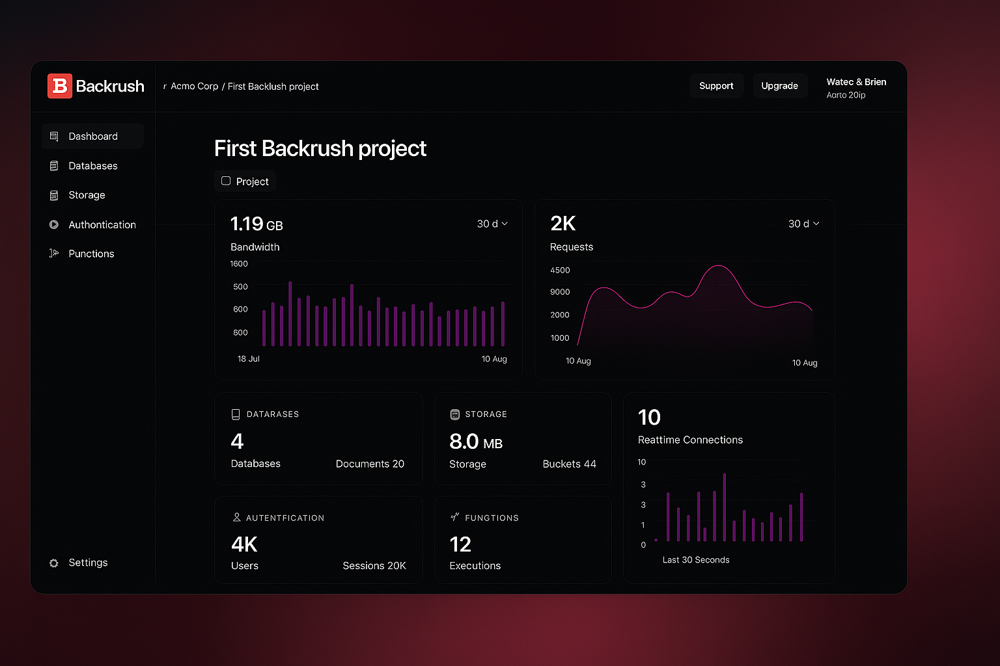

# Console 🖥️

[Backrush](https://backrush.io) Console is the Graphical User Interface that developers interact with when accessing their Backrush instance in the web browser.

Backrush Console has been built with the following frameworks:

- [Svelte](https://svelte.dev/)
- [Svelte Kit](https://kit.svelte.dev/)

## Developer Experience

Developer experience has always been a priority for Backrush since its inception. The web console is one of the most important pieces of the developer experience puzzle. The new web console not only looks better but serves a functional purpose.

### Simplicity

The new UI reduces visual load with more purposeful color use and more selective inclusion of information.

### Consistency

The new Backrush Console uses a consistent UI library, so navigating from page to page and task to task will flow seamlessly.

### Accessibility

Console 2.0 is designed to be accessible, from design to code. Console 2.0 is also designed to be accessible to developers of all skill levels. Complex workflows will provide more guidance for newer developers and promote good technical decisions.

### Scalability and Collaboration

The new console is more maintainable and welcoming to community contributions. Console 2.0 is built using Svelte instead of our own library. It's better documented and well-known, making it easier for developers to contribute to Backrush.

## Contributing

All code contributions, including those of people with commit access, must go through a pull request and be approved by a core developer before being merged. This is to ensure a proper review of all the code.

We truly ❤️ pull requests! If you wish to help, you can learn more about how you can contribute to this project in the [contribution guide](CONTRIBUTING.md).

## Security

For security issues, kindly email us at [hello@backrush.io](mailto:hello@backrush.io) instead of posting a public issue on GitHub.

## License

This repository is available under the [BSD 3-Clause License](./LICENSE).
